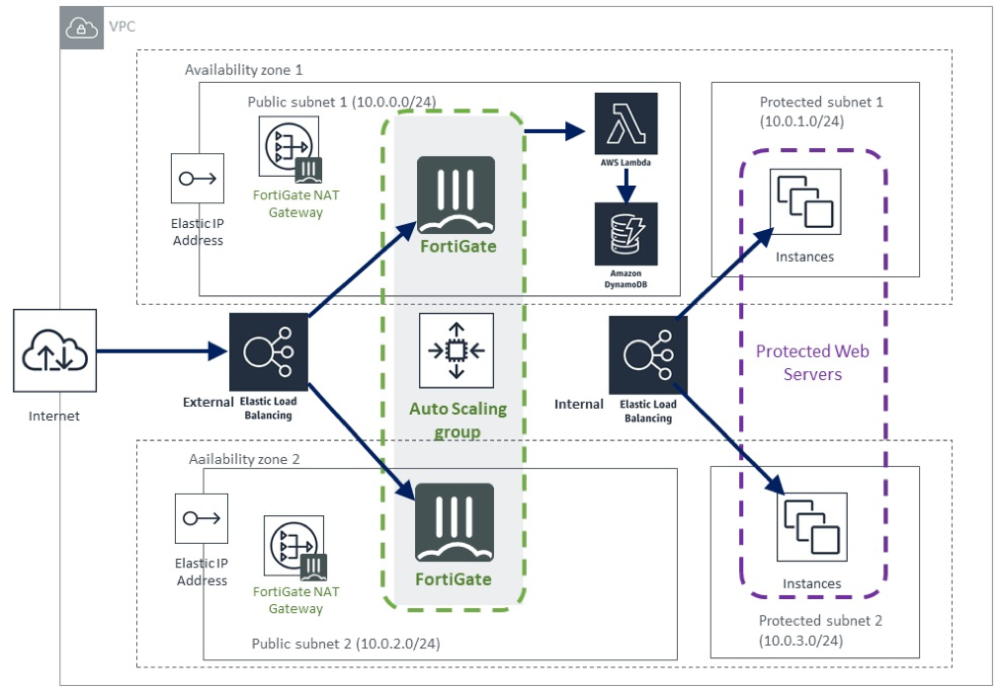

# quickstart-fortinet-fortigate-autoscale

## Fortinet FortiGate Auto Scaling Baseline on the AWS Cloud

This Quick Start deploys FortiGate Auto Scaling, a next-generation firewall (NGFW) from Fortinet, on the Amazon Web Services (AWS) Cloud in about 15 minutes.

FortiGate mid-range next-generation firewalls (NGFWs) provide high performance, multi-layered advanced security, and better visibility to protect against cyber attacks while reducing complexity. FortiGate firewalls are purpose-built with security processors to enable the industry’s best threat protection and performance for Secure Sockets Layer (SSL)-encrypted traffic.

This Quick Start deploys an automatically scaled group of FortiGate instances, which provide intrusion protection, web filtering, and threat detection to protect your services from cyber attacks. The Quick Start uses AWS CloudFormation templates to build the AWS infrastructure and to deploy the FortiGates to protect your workloads.

The Quick Start offers two deployment options:

 - [Deploying FortiGate into a new virtual private cloud (VPC) on AWS](https://us-east-2.console.aws.amazon.com/cloudformation/home?region=us-east-2#/stacks/new?stackName=FortigateASG&templateURL=https:%2F%2Fs3.amazonaws.com%2Faws-quickstart%2Fquickstart-fortinet-fortigate%2Ftemplates%2Fworkload-master.template)
 - [Deploying FortiGate into an existing VPC on AWS](https://us-east-2.console.aws.amazon.com/cloudformation/home?region=us-east-2#/stacks/new?stackName=FortigateASG&templateURL=https:%2F%2Fs3.amazonaws.com%2Faws-quickstart%2Fquickstart-fortinet-fortigate%2Ftemplates%2Fworkload.template)

You can also use the AWS CloudFormation templates as a starting point for your own implementation.

For architectural details, step-by-step instructions, and customization options, see the (deployment guide)(https://fwd.aws/xjzgv). 

To post feedback, submit feature ideas, or report bugs, use the Issues section of this GitHub repo. If you'd like to submit code for this Quick Start, please review the [AWS Quick Start Contributor's Kit](https://aws-quickstart.github.io/).
